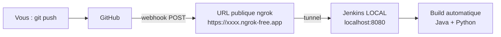

<a id="top"></a>

# Projet 6 — Webhook GitHub → Jenkins **local** (sans VPS) avec ngrok

> **Pratique guidée** · Module [05 — Jenkins : pipeline CI/CD](../README.md)
>
> Objectif : à chaque **`git push`**, GitHub déclenche **automatiquement** un build Jenkins — alors que Jenkins tourne **sur votre PC** (localhost), **sans VPS** ni ouverture de port sur votre box.
>
> Pressé ? Voir l'**[aide-mémoire des commandes](COMMANDES.md)**.

---

## Le problème (et la solution)

GitHub vit sur Internet ; votre Jenkins tourne sur `http://localhost:8080`. GitHub **ne peut pas** joindre `localhost`. Il faut donc une **URL publique** qui pointe vers votre Jenkins local.

C'est le rôle d'un **tunnel**. Le plus simple s'appelle **ngrok** *(c'est le nom que vous cherchiez !)*. Il crée une URL publique `https://xxxx.ngrok-free.app` qui redirige vers votre `localhost:8080`.



> **Alternatives au même principe** (toutes sans VPS) :
> - **Cloudflare Tunnel** (`cloudflared`) — gratuit, URL stable.
> - **smee.io** — proxy de webhooks pensé pour ça (relai des *payloads*).
> - **ngrok** — le plus rapide à mettre en place ; c'est l'option retenue ici, **intégrée au `docker-compose`**.

---

## Prérequis

- **Docker Desktop** installé et démarré.
- Un compte **GitHub**.
- Un compte **ngrok** (gratuit) pour obtenir un *authtoken* : <https://dashboard.ngrok.com/get-started/your-authtoken>.

```bash
docker --version
docker compose version
```

---

## Structure du projet

```text
projet06-jenkins-webhook-ngrok/
├── docker-compose.yml          <- 2 services : jenkins + ngrok
├── Dockerfile                  <- Jenkins + JDK 17 + Python 3 + plugins GitHub
├── .env.example                <- modele pour votre authtoken ngrok
├── README.md                   <- ce fichier
├── COMMANDES.md                <- aide-memoire
└── depot-exemple/              <- a pousser sur VOTRE depot GitHub
    ├── Jenkinsfile             <- declencheur githubPush()
    ├── HelloWorld.java
    ├── hello.py
    └── .gitignore
```

---

## Étape 1 — Configurer ngrok

1. Créez un compte gratuit sur [ngrok.com](https://ngrok.com) et copiez votre **authtoken**.
2. Dans ce dossier, copiez `.env.example` en **`.env`** et collez votre token :

```bash
cp .env.example .env
```

```ini
# .env
NGROK_AUTHTOKEN=2abc...votre_token...xyz
```

> Le fichier `.env` ne doit **jamais** être poussé sur GitHub (il contient un secret).

---

## Étape 2 — Démarrer Jenkins + ngrok

```bash
docker compose up -d --build
```

- **Jenkins** : <http://localhost:8080> (aucun mot de passe, assistant désactivé).
- **Tableau de bord ngrok** : <http://localhost:4040> → vous y voyez l'**URL publique** générée, par ex. :

```text
https://1a2b-3c4d.ngrok-free.app  ->  http://jenkins:8080
```

> Port 8080 occupé ? Voir l'**[Annexe — Le port 8080 est déjà occupé ?](COMMANDES.md#annexe--le-port-8080-est-déjà-occupé-)**.

---

## Étape 3 — Pousser le dépôt sur GitHub

Copiez le contenu de [`depot-exemple/`](depot-exemple) dans un dépôt GitHub (ex. `jenkins-pipeline-test`) :

```bash
cd depot-exemple
git init
git add .
git commit -m "Initial commit : pipeline + Jenkinsfile"
git branch -M main
git remote add origin https://github.com/VOTRE-COMPTE/jenkins-pipeline-test.git
git push -u origin main
```

---

## Étape 4 — Créer le job Jenkins

| # | Action |
|---|---|
| 01 | **New Item** → nom `webhook-test` → type **Pipeline** → **OK**. |
| 02 | *Build Triggers* : cochez **« GitHub hook trigger for GITScm polling »**. |
| 03 | *Pipeline* → **Definition = Pipeline script from SCM** → **SCM = Git**. |
| 04 | **Repository URL** = votre dépôt (+ credential si privé, voir ci-dessous). |
| 05 | **Branch Specifier** = `*/main`. **Script Path** = `Jenkinsfile`. **Save**. |

> **Dépôt privé ?** *Manage Jenkins → Credentials → Add → Username with password* : identifiant GitHub + **jeton d'accès personnel** (Settings GitHub → Developer settings → Personal access tokens, permission **repo**). ID = `github-token`, puis sélectionnez-le dans le job.

---

## Étape 5 — Créer le webhook GitHub

1. Dépôt GitHub → **Settings → Webhooks → Add webhook**.
2. Renseignez :
   - **Payload URL** = `https://VOTRE-URL-NGROK.ngrok-free.app/github-webhook/`
     *(reprenez l'URL affichée sur http://localhost:4040, et n'oubliez pas le `/github-webhook/` final)* ;
   - **Content type** = `application/json` ;
   - **Which events?** = *Just the push event* ;
   - *(facultatif)* **Secret** : laissez vide pour ce test.
3. **Add webhook**.

GitHub envoie aussitôt un *ping* : dans **Recent Deliveries**, vous devez voir une réponse **200**.

---

## Étape 6 — Tester : `git push` déclenche le build

```bash
echo "// petite modification" >> HelloWorld.java
git add .
git commit -m "Test webhook"
git push origin main
```

En quelques secondes, **un build démarre tout seul** dans Jenkins. Ouvrez-le :

```text
+ javac HelloWorld.java
+ java HelloWorld
Hello, World from Jenkins Pipeline!
+ python3 hello.py
Hello, World from Jenkins Pipeline!
Finished: SUCCESS
```

C'est le **`triggers { githubPush() }`** du `Jenkinsfile`, combiné à l'option *GitHub hook trigger*, qui relie le push au build.

---

## Dépannage

| Symptôme | Vérification |
|---|---|
| Le build ne démarre pas | Sur GitHub → webhook → **Recent Deliveries** : la réponse est-elle **200** ? Sinon, l'URL ngrok est fausse ou expirée. |
| `404` sur le webhook | L'URL doit **finir** par `/github-webhook/` (avec le slash final). |
| L'URL ngrok a changé | Sur le plan gratuit, l'URL change à chaque redémarrage de ngrok : remettez la nouvelle URL dans le webhook (ou utilisez un *domaine ngrok* réservé). |
| `Python introuvable` | `docker exec jenkins-webhook-tp which python3` (doit renvoyer `/usr/bin/python3`). |
| Clonage Git échoue | Vérifiez le credential (jeton avec permission **repo**) et l'URL `https://`. |

> **Astuce :** pour rejouer un webhook sans refaire un push, GitHub → webhook → **Recent Deliveries** → **Redeliver**.

---

## (Facultatif) Sécuriser le webhook avec un *secret*

1. Choisissez une phrase secrète.
2. Mettez-la dans le champ **Secret** du webhook GitHub.
3. Dans Jenkins : *Manage Jenkins → System → GitHub → Advanced → Shared secret* (même valeur).

Ainsi, Jenkins vérifie que la requête vient bien de GitHub (signature HMAC).

---

## Arrêter / réinitialiser

```bash
docker compose stop          # arreter (donnees conservees)
docker compose down          # supprimer les conteneurs (volume conserve)
docker compose down -v       # tout supprimer (config Jenkins incluse)
```

---

<p align="center">
  <strong>Cours créé par Dr. Haythem REHOUMA — Développement et déploiement de solutions de données</strong>
</p>
