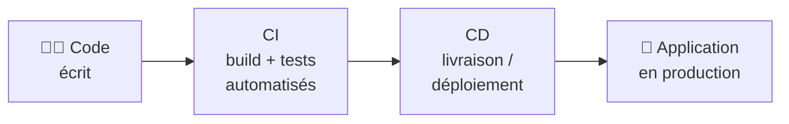
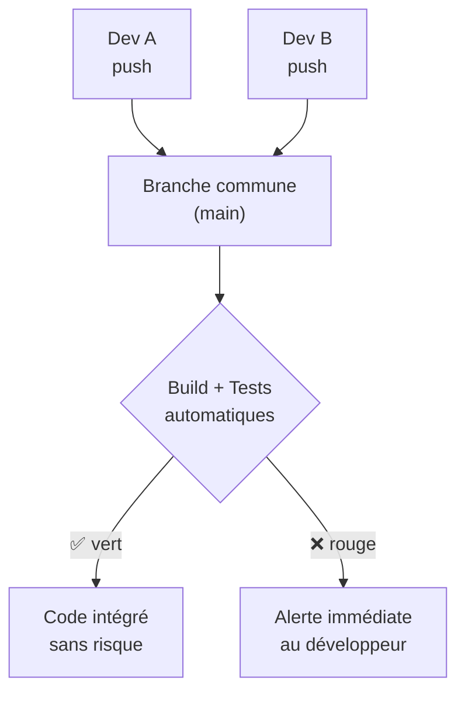
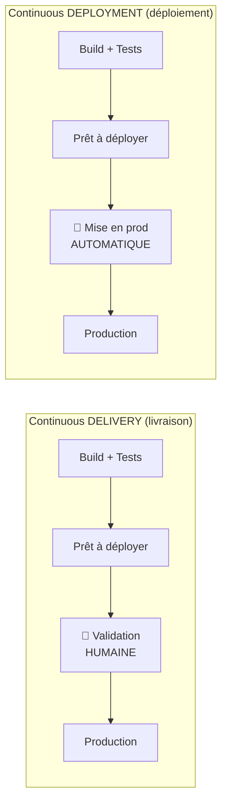
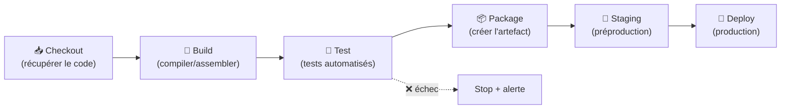
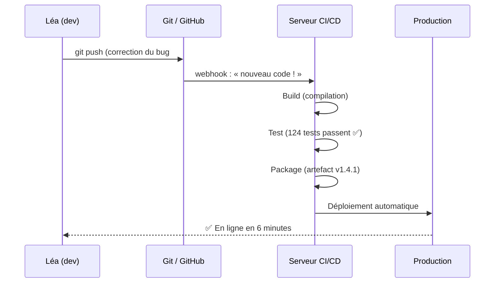
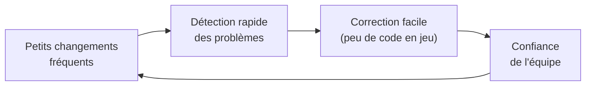
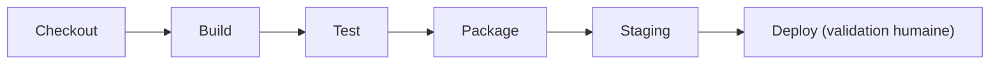
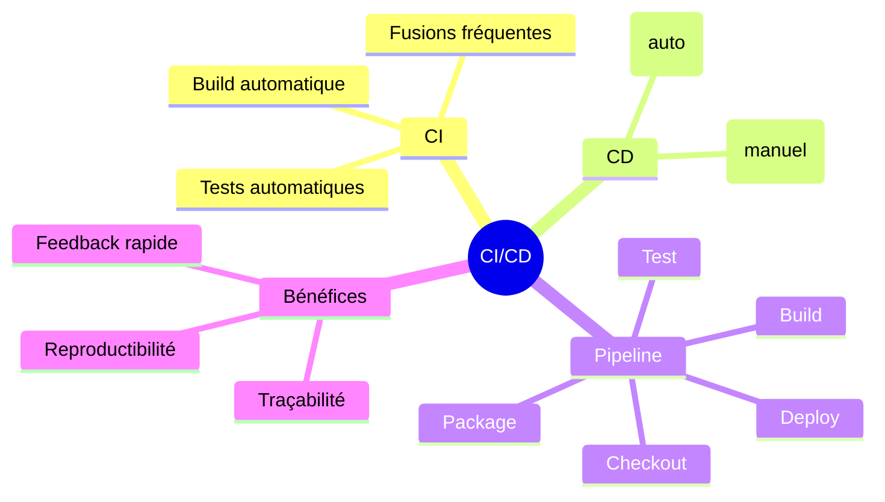

# 03 — CI/CD : concepts et pipeline

## Table des matières

| # | Section |
|---|---|
| 1 | [Qu'est-ce que le CI/CD ?](#section-1) |
| 2 | [CI — Intégration continue](#section-2) |
| 3 | [CD — Livraison vs Déploiement continu](#section-3) |
| 4 | [Le pipeline CI/CD étape par étape](#section-4) |
| 5 | [Un exemple concret de bout en bout](#section-5) |
| 6 | [Les avantages de l'automatisation](#section-6) |
| 7 | [Quiz — Concepts CI/CD](#section-7) |
| 8 | [Pratique — Concevoir son premier pipeline](#section-8) |
| 9 | [Synthèse](#section-9) |

---

1 — Qu'est-ce que le CI/CD ?

 

Le **CI/CD** est l'**épine dorsale technique du DevOps**. C'est l'ensemble des pratiques qui automatisent le chemin entre « le code écrit par un développeur » et « l'application qui tourne en production ».

| Sigle | Nom | En une phrase |
|---|---|---|
| **CI** | Intégration continue (*Continuous Integration*) | On fusionne et on teste le code **souvent et automatiquement**. |
| **CD** | Livraison continue (*Continuous Delivery*) | Le code testé est **toujours prêt** à être déployé (mise en prod manuelle). |
| **CD** | Déploiement continu (*Continuous Deployment*) | Le code testé part **automatiquement** en production. |

> _Sans CI/CD, livrer un logiciel ressemble à un déménagement à la main : lent, fatigant et risqué. Avec CI/CD, c'est un tapis roulant automatisé : on pose le code à un bout, l'application arrive prête à l'autre._

**🔧 Mini-exercice —** Reliez chaque sigle à sa définition : (1) CI, (2) Continuous Delivery, (3) Continuous Deployment.

✅ Voir une solution

(1) CI = fusion + build + tests automatiques fréquents. (2) Continuous **Delivery** = toujours prêt à déployer, **bouton manuel** pour la prod. (3) Continuous **Deployment** = mise en prod **automatique** après tests réussis.

<a href="#top">↑ Retour en haut</a>

---

2 — CI — Intégration continue

 

L'**intégration continue** consiste à **fusionner fréquemment** le code de tous les développeurs dans une branche commune, et à **valider automatiquement** chaque fusion par un build et des tests.

### Pourquoi « continue » ?

| Sans CI | Avec CI |
|---|---|
| On fusionne tout en fin de mois → gros conflits douloureux | On fusionne plusieurs fois par jour → petits conflits faciles |
| Les bugs sont découverts tard | Les bugs sont découverts en minutes |
| « Ça marchait sur ma machine » | Build reproductible sur le serveur |

> _Analogie : ranger sa cuisine au fur et à mesure (CI) plutôt que d'attendre que tout soit sale (intégration « big bang »). Le petit effort fréquent évite la catastrophe rare._

**🔧 Mini-exercice —** Un développeur garde son code 3 semaines sans le fusionner, puis tente un gros merge. Quel principe d'intégration continue n'a-t-il pas respecté, et quelle conséquence est probable ?

✅ Voir une solution

Il n'a pas fusionné **fréquemment**. Conséquence probable : un **conflit de fusion massif** et difficile à résoudre, et des bugs détectés très tard. La CI recommande de petites fusions fréquentes.

<a href="#top">↑ Retour en haut</a>

---

3 — CD — Livraison vs Déploiement continu

 

Les deux « CD » se ressemblent mais diffèrent sur **un seul point** : qui appuie sur le bouton de mise en production.

| | Continuous Delivery | Continuous Deployment |
|---|---|---|
| Mise en production | **Manuelle** (un humain clique) | **Automatique** |
| Contrôle | Décision finale humaine | Aucune intervention |
| Idéal pour | Secteurs réglementés, releases planifiées | Équipes matures, fort taux de tests |

> _Continuous Delivery = la voiture est garée devant la porte, prête, clés sur le contact ; vous décidez quand démarrer. Continuous Deployment = la voiture autonome démarre toute seule dès qu'elle est prête._

**🔧 Mini-exercice —** Une banque veut que chaque mise en production soit approuvée par un responsable. Quel « CD » choisir ?

✅ Voir une solution

**Continuous Delivery** : le pipeline rend la version prête automatiquement, mais la mise en production reste une **décision humaine** (validation du responsable).

<a href="#top">↑ Retour en haut</a>

---

4 — Le pipeline CI/CD étape par étape

 

Un **pipeline** est une suite d'étapes automatisées (appelées **stages**) qui transforment le code source en application déployée. **Si une étape échoue, le pipeline s'arrête** et l'équipe est notifiée.

| Stage | Rôle | Exemple d'outil |
|---|---|---|
| **Checkout** | Récupérer le code depuis Git | Git |
| **Build** | Compiler / assembler | Maven, npm, javac |
| **Test** | Vérifier automatiquement | JUnit, pytest |
| **Package** | Produire un **artefact** livrable | `.jar`, image Docker |
| **Staging** | Déployer en préproduction | serveur de test |
| **Deploy** | Mettre en production | serveur / cloud |

> _Le principe du « **fail fast** » : on place les étapes rapides et pas chères (compilation, tests unitaires) **en premier**. Inutile de déployer si le code ne compile même pas._

**🔧 Mini-exercice —** Dans quel ordre placer ces stages : `Deploy`, `Build`, `Test`, `Checkout` ?

✅ Voir une solution

`Checkout` → `Build` → `Test` → `Deploy`. On récupère le code, on le compile, on le teste, et on ne déploie **que** si tout est vert.

<a href="#top">↑ Retour en haut</a>

---

5 — Un exemple concret de bout en bout

 

Suivons le parcours d'**une seule ligne de code** corrigée par une développeuse, Léa, dans une application web.

**Déroulé pas à pas :**

1. Léa corrige un bug et fait `git push`.
2. Un **webhook** prévient le serveur CI/CD qu'il y a du nouveau code.
3. Le pipeline **compile**, lance les **124 tests** (tous verts), puis **empaquette** la version `v1.4.1`.
4. La version est **déployée automatiquement**.
5. Six minutes après le push, la correction est en ligne — **sans intervention manuelle**.

> _Comparez : avant le CI/CD, cette même correction aurait demandé une mise en production planifiée, un soir, à la main, avec le stress du « pourvu que ça marche ». Ici, c'est une routine de 6 minutes._

**🔧 Mini-exercice —** À l'étape 3, 2 tests sur 124 échouent. Que fait le pipeline, et la version part-elle en production ?

✅ Voir une solution

Le pipeline **s'arrête** au stage Test, notifie Léa, et **ne déploie pas**. La production reste sur la version stable précédente. C'est le principe « fail fast » qui protège la prod.

<a href="#top">↑ Retour en haut</a>

---

6 — Les avantages de l'automatisation

 

| Avantage | Ce que ça change concrètement |
|---|---|
| **Moins d'erreurs humaines** | Les tâches répétitives sont scriptées : plus d'oubli d'étape |
| **Feedback rapide** | On sait en **minutes** si un changement casse quelque chose |
| **Déploiements fréquents** | On peut livrer **plusieurs fois par jour** en confiance |
| **Reproductibilité** | Chaque build est identique — fini le « ça marche sur ma machine » |
| **Traçabilité** | Chaque changement est enregistré : qui, quoi, quand |

> _Plus on déploie souvent, plus chaque déploiement est **petit**, donc **moins risqué**. C'est contre-intuitif : déployer plus souvent rend les déploiements plus sûrs, pas plus dangereux._

**🔧 Mini-exercice —** Citez deux raisons pour lesquelles déployer 10 fois par jour de **petits** changements est moins risqué qu'un seul **gros** déploiement par mois.

✅ Voir une solution

1) Chaque déploiement contient peu de code → un bug est **facile à localiser**. 2) Le **rollback** est simple (peu de changements à annuler). Le gros déploiement mensuel concentre au contraire beaucoup de risques d'un coup.

<a href="#top">↑ Retour en haut</a>

---

7 — Quiz — Concepts CI/CD

 

**Question 1 :** Que signifie « CI » ?

a) Code Inspection

b) Continuous Integration

c) Container Initialization

d) Central Infrastructure

💡 Voir la solution

✅ **Réponse : b)** — *Continuous Integration* : fusion et validation automatiques fréquentes du code.

---

**Question 2 :** Quelle est la différence entre Continuous Delivery et Continuous Deployment ?

a) Aucune, ce sont des synonymes

b) En Delivery la mise en prod est manuelle ; en Deployment elle est automatique

c) Le Deployment ne fait pas de tests

d) La Delivery déploie automatiquement

💡 Voir la solution

✅ **Réponse : b)** — Les deux préparent une version prête ; seule la **mise en production** diffère (manuelle vs automatique).

---

**Question 3 :** Que se passe-t-il si le stage **Test** échoue dans un pipeline ?

a) Le pipeline continue quand même jusqu'en production

b) Le pipeline s'arrête et l'équipe est notifiée

c) Le code est supprimé du dépôt

d) Le pipeline recommence à l'infini

💡 Voir la solution

✅ **Réponse : b)** — Principe « fail fast » : un échec stoppe le pipeline et déclenche une alerte ; rien ne part en production.

---

**Question 4 :** Qu'est-ce qu'un **artefact** dans un pipeline ?

a) Un bug introduit par erreur

b) Le résultat empaqueté d'un build (ex. un `.jar`, une image)

c) Un message dans les logs

d) Un utilisateur du système

💡 Voir la solution

✅ **Réponse : b)** — L'artefact est le livrable produit par le build, prêt à être déployé.

---

**Question 5 :** Pourquoi déployer souvent rend-il les déploiements plus sûrs ?

a) Parce que chaque déploiement est plus petit et donc plus facile à diagnostiquer et à annuler

b) Parce qu'on supprime les tests

c) Parce que les serveurs deviennent plus puissants

d) Parce que les utilisateurs ne s'en aperçoivent pas

💡 Voir la solution

✅ **Réponse : a)** — De petits changements fréquents réduisent la surface de risque et facilitent le rollback.

<a href="#top">↑ Retour en haut</a>

---

8 — Pratique — Concevoir son premier pipeline

 

### Consigne

Une équipe développe une application Java. Concevez (sur papier / en pseudo-pipeline) les **stages** d'un pipeline CI/CD pour cette application, en indiquant pour chaque stage : son **nom**, son **rôle**, et **ce qui doit arrêter le pipeline**. Précisez aussi si vous recommandez du *Continuous Delivery* ou du *Continuous Deployment*, et pourquoi.

---

### Correction proposée

| Ordre | Stage | Rôle | Condition d'arrêt |
|---|---|---|---|
| 1 | **Checkout** | Récupérer le code depuis Git | Dépôt inaccessible |
| 2 | **Build** | Compiler avec Maven (`mvn package`) | Erreur de compilation |
| 3 | **Test** | Lancer les tests JUnit | Un test échoue |
| 4 | **Package** | Produire l'artefact `.jar` / image | Échec d'empaquetage |
| 5 | **Staging** | Déployer en préproduction | Démarrage applicatif KO |
| 6 | **Deploy** | Mettre en production | Validation manuelle refusée |

**Choix recommandé pour débuter : Continuous Delivery.**

> _Justification : tant que la couverture de tests n'est pas mûre, on garde une **validation humaine** avant la production (Delivery). Quand l'équipe a confiance dans ses tests automatisés, elle peut passer en Continuous Deployment (mise en prod automatique)._

**Schéma attendu :**

<a href="#top">↑ Retour en haut</a>

---

9 — Synthèse

 

#### Points à retenir

1. **CI/CD = l'automatisation du chemin du code à la production**, cœur technique du DevOps.
2. **CI** : fusionner et tester **souvent et automatiquement**.
3. **CD** : *Delivery* (prêt à déployer, bouton manuel) vs *Deployment* (mise en prod automatique).
4. **Le pipeline** enchaîne des **stages** ; un échec **arrête** tout (fail fast).
5. **Déployer souvent et petit** = moins de risque, feedback rapide, rollback facile.

#### La suite

Leçon **04 — Stratégies de déploiement** : comment passer de la v1 à la v2 en production sans casser le service (Blue/Green, Canary, Rolling…).

<a href="#top">↑ Retour en haut</a>

---

  <em>Tous droits réservés. Toute reproduction, diffusion, utilisation ou adaptation de ce cours, en tout ou en partie, est strictement interdite sans l'autorisation écrite préalable de Dr. Haythem REHOUMA.</em>

  <strong>Cours créé par Dr. Haythem REHOUMA — Développement et déploiement de solutions de données</strong>

