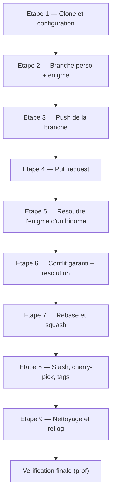

<a id="top"></a>

# TP1 — Git et GitHub · Partie 2 (Concours Git avancé)

> **Suite du** [TP1 — Partie 1](README.md) · **Atelier-concours** (bonus) · Manipulations Git avancées
>
> **Module :** [02 — Git avancé et GitHub](../../../02-git-avance-et-github/README.md)

---

## C'est un concours, niveau expert !

Après la Partie 1, place aux **manipulations avancées** : **rebase**, **squash**, **stash**, **cherry-pick**, **tags** et **reflog**. Ici aussi, c'est une **compétition** : chaque technique correctement réalisée rapporte des **points**.

> **Le champion de la Partie 2** est celui qui cumule le plus de **points de maîtrise** (voir le [tableau du concours](#tableau-du-concours-points)) avec un **historique propre**.



---

## Règles de sécurité (à lire AVANT de commencer)

> Cet atelier se fait à **toute la classe** sur un dépôt partagé. Pour ne casser le travail de personne :

1. **Chaque étudiant a sa propre branche** : `enigme_prenom` (ex. `enigme_lea`). Vous ne travaillez **jamais** sur la branche d'un autre.
2. **Chaque étudiant a son propre fichier d'énigme** : `enigmes/prenom.txt`.
3. **`git push --force` est autorisé UNIQUEMENT sur VOTRE branche personnelle.** **Jamais** sur `main`, **jamais** sur la branche de quelqu'un d'autre. Un force-push au mauvais endroit **efface le travail des autres**.
4. **`main` est protégée** : on n'y arrive que par **pull request** validée par le professeur (ou par les fusions encadrées des étapes de conflit).
5. **Tags nominatifs** : nommez vos tags `v1.0-prenom` (ex. `v1.0-lea`) pour éviter les collisions entre étudiants.

> Convention : partout où vous lisez `prenom`, remplacez par **votre** prénom en minuscules, sans accent ni espace (ex. `lea`, `marc`, `paul`).

---

## Étape 1 — Clonage et configuration

```bash
git clone git@github.com:hrhouma/ChasseAuTresor.git
cd ChasseAuTresor
git config --global user.name "Prénom Nom"
git config --global user.email "votre.courriel@exemple.com"
```

Vérifiez la connexion SSH et l'état du dépôt :

```bash
ssh -T git@github.com
git branch -a
git status
```

---

## Étape 2 — Créer votre branche et votre énigme

```bash
git switch -c enigme_prenom
mkdir -p enigmes
echo "Je suis un légume, mais je suis aussi une couleur. Qui suis-je ?" > enigmes/prenom.txt
git add enigmes/prenom.txt
git commit -m "Ajouter l'énigme de Prénom"
git log --oneline --graph
```

> Inventez **votre** énigme. Chacun écrit dans **son** fichier `enigmes/prenom.txt` : aucun conflit à cette étape.

---

## Étape 3 — Pousser votre branche

```bash
git push -u origin enigme_prenom
git branch -r
```

---

## Étape 4 — Pull request

Sur GitHub :
1. Ouvrez une **pull request** de `enigme_prenom` vers `main`.
2. Rédigez un titre et une description (quelle est votre énigme ?).
3. Le **professeur** examine et fusionne la PR dans `main`.

Mettez ensuite votre `main` local à jour :

```bash
git switch main
git pull origin main
```

---

## Étape 5 — Résoudre l'énigme d'un binôme

> Le professeur attribue à chacun **un binôme** (ex. Léa résout l'énigme de Paul). Vous ajoutez votre réponse dans le fichier de l'autre, via **votre** branche, puis pull request.

```bash
git switch enigme_prenom
git pull origin main                       # récupérer les énigmes fusionnées
echo "Réponse de Prénom : la carotte" >> enigmes/binome.txt
git add enigmes/binome.txt
git commit -m "Répondre à l'énigme de Binôme"
git push origin enigme_prenom
```

Ouvrez une pull request → le professeur fusionne.

---

## Étape 6 — Conflit garanti et résolution

> Le professeur forme des **paires** et leur demande de modifier **la même ligne du même fichier**. Le conflit apparaît à la fusion. C'est **voulu**.

1. Les deux membres de la paire modifient la **même ligne** de `enigmes/cible.txt` sur leur branche respective, committent et poussent.
2. La **première** pull request est fusionnée sans souci.
3. Le **second** doit intégrer `main` et **résoudre le conflit** :

```bash
git switch enigme_prenom
git pull origin main          # déclenche le conflit
# Git signale un conflit dans enigmes/cible.txt
# Ouvrez le fichier, gardez les deux réponses, supprimez les marqueurs <<<<<<< ======= >>>>>>>
git add enigmes/cible.txt
git commit -m "Résoudre le conflit dans cible.txt"
git push origin enigme_prenom
```

Le professeur fusionne ensuite la branche corrigée.

> **Réflexe :** un conflit n'est pas une erreur, c'est une situation normale en équipe. On lit, on garde les bonnes parties, on valide.

---

## Étape 7 — Rebase et squash (sur VOTRE branche uniquement)

> Objectif : un historique propre. On **rebase sa branche perso** sur `main`, puis on **regroupe (squash)** plusieurs petits commits en un seul.

1. Rebaser votre branche sur `main` à jour :

```bash
git switch enigme_prenom
git fetch origin
git rebase origin/main
```

2. Regrouper vos 3 derniers commits en un seul :

```bash
git rebase -i HEAD~3
# Dans l'éditeur : laissez "pick" sur le 1er, mettez "squash" (ou "s") sur les 2 autres,
# puis rédigez un message de commit final clair.
```

3. Comme le rebase **réécrit l'historique de votre branche**, vous devez forcer le push — **mais seulement sur VOTRE branche** :

```bash
git push --force-with-lease origin enigme_prenom
```

> On utilise `--force-with-lease` (et non `--force` brut) : il **refuse** d'écraser si quelqu'un d'autre a poussé entre-temps. Plus sûr.
>
> **Rappel :** jamais de force-push sur `main` ni sur la branche d'un autre.

---

## Étape 8 — Stash, cherry-pick et tags

### Stash — mettre de côté un travail en cours

```bash
git switch enigme_prenom
echo "Modification temporaire" >> enigmes/prenom.txt
git stash                      # range les modifications de côté
git stash list                 # vérifie ce qui est rangé
git stash pop                  # récupère et retire de la pile
git add enigmes/prenom.txt
git commit -m "Reprendre le travail mis de côté"
git push origin enigme_prenom
```

### Cherry-pick — appliquer un commit précis

```bash
git log --oneline origin/main           # repérez le hash du commit voulu
git cherry-pick <hash-du-commit>
git push origin enigme_prenom
```

### Tags — marquer une version (nom unique par étudiant)

```bash
git tag -a v1.0-prenom -m "Version stable 1.0 de Prénom"
git push origin v1.0-prenom
```

> Utilisez `v1.0-prenom` (ex. `v1.0-lea`) : si tout le monde crée `v1.0`, il y a collision de tags.

---

## Étape 9 — Nettoyage et historique

```bash
git switch main
git pull origin main
git branch -d enigme_prenom               # supprime votre branche locale (après fusion)
git push origin --delete enigme_prenom    # supprime votre branche distante (optionnel)
git reflog                                # historique complet de vos actions locales
git log --oneline --graph --all           # vue d'ensemble du projet
git log --stat                            # statistiques par commit
```

> `git reflog` est votre filet de sécurité : il garde la trace de **tout** ce que vous avez fait localement, même après un rebase. C'est ce qui permet de **récupérer** un commit « perdu ».

---

## Tableau du concours (points)

> Chaque technique **correctement réalisée et vérifiable** dans l'historique rapporte des points. Le professeur valide avec `git log --graph --all`, `git reflog` et `git shortlog -sn --all`.

| Technique | Points | Vérification |
|---|---|---|
| Branche perso + énigme poussée | 1 | `git branch -r` |
| Pull request fusionnée | 2 | onglet Pull requests |
| Énigme d'un binôme résolue | 1 | contenu du fichier cible |
| **Conflit résolu proprement** | 3 | historique de fusion |
| **Rebase + squash réussi** | 3 | historique compacté |
| Stash utilisé (pop sans perte) | 1 | `git reflog` |
| Cherry-pick appliqué | 2 | commit dupliqué propre |
| Tag nominatif poussé | 1 | `git tag` / Releases |
| **Historique le plus propre** | 2 (bonus) | jugé par le prof |

| Récompense | Comment elle est attribuée |
|---|---|
| 🏆 **Maître Git** | Le plus grand total de points |
| 🧼 **Prix de l'historique propre** | Historique le plus lisible après rebase/squash |
| ⚡ **Prix de vitesse** | Premier à compléter toutes les étapes sans casser `main` |

---

## Récapitulatif des manipulations couvertes

| Thème | Commandes clés |
|---|---|
| Cloner / configurer | `git clone`, `git config`, `ssh -T` |
| Branches | `git switch -c`, `git branch -a`, `git branch -d` |
| Publier | `git push -u origin`, `git push --delete` |
| Pull request | interface GitHub / `gh pr create` |
| Conflits | `git pull`, résolution manuelle, `git add`, `git commit` |
| Réécrire l'historique | `git rebase`, `git rebase -i` (squash), `git push --force-with-lease` |
| Outils avancés | `git stash`, `git cherry-pick`, `git tag` |
| Diagnostic | `git reflog`, `git log --graph`, `git log --stat`, `git diff` |

---

## Rôle du professeur

Le professeur **guide** l'atelier et intervient aux moments clés, tout en laissant les étudiants faire les manipulations :

1. **Démarrage** : vérifie que chacun a cloné le dépôt et configuré Git (nom, courriel, SSH).
2. **Pull requests** : examine et **fusionne** chaque PR dans `main`.
3. **Scénarios de conflit** : forme les **paires** et déclenche volontairement les conflits, puis attribue la résolution.
4. **Supervision** : accompagne la résolution de conflits et le rebase (rappelle la règle du force-push limité à la branche perso).
5. **Tags** : valide les versions nominatives (`v1.0-prenom`).
6. **Verdict du concours** : compte les points avec `git log --graph --all`, `git reflog`, `git shortlog -sn --all`, et désigne le **Maître Git**.

---

## Annexe — Aide-mémoire personnel (remplacez `prenom`)

```bash
# 1. Démarrer
git clone git@github.com:hrhouma/ChasseAuTresor.git
cd ChasseAuTresor
git config --global user.name "Prénom Nom"
git config --global user.email "votre.courriel@exemple.com"

# 2. Ma branche et mon énigme
git switch -c enigme_prenom
mkdir -p enigmes
echo "Mon énigme..." > enigmes/prenom.txt
git add enigmes/prenom.txt
git commit -m "Ajouter l'énigme de Prénom"
git push -u origin enigme_prenom

# 3. Mettre à jour après fusions
git switch main && git pull origin main

# 4. Rebase + squash (sur MA branche)
git switch enigme_prenom
git fetch origin
git rebase origin/main
git rebase -i HEAD~3
git push --force-with-lease origin enigme_prenom

# 5. Outils avancés
git stash ; git stash list ; git stash pop
git cherry-pick <hash>
git tag -a v1.0-prenom -m "Version 1.0 de Prénom"
git push origin v1.0-prenom

# 6. Nettoyage
git switch main && git pull origin main
git branch -d enigme_prenom
git push origin --delete enigme_prenom
git reflog
git log --oneline --graph --all
```

---

<p align="center">
  <em>Tous droits réservés. Toute reproduction, diffusion, utilisation ou adaptation de ce cours, en tout ou en partie, est strictement interdite sans l'autorisation écrite préalable de Dr. Haythem REHOUMA.</em>
</p>

<p align="center">
  <strong>Cours créé par Dr. Haythem REHOUMA — Développement et déploiement de solutions de données</strong>
</p>
